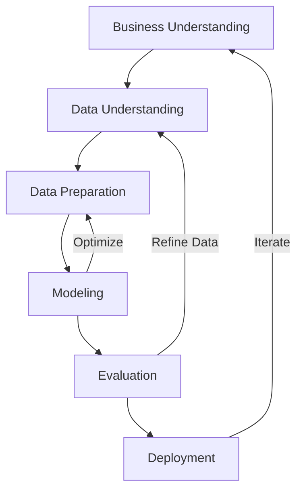

# Sauron Decompiler

<p align="center">
    
    
    <a href="https://django.readthedocs.io/en/stable/" target="_blank"></a>
    <a href="https://huggingface.co/" target="_blank"></a>
</p>

<p align="center">
    
</p>

---

Sauron Decompiler is a machine learning-powered project dedicated to the challenging task of decompiling binary executables back into human-readable C source code. Like the mythical phoenix rising from ashes, this project aims to reconstruct the original form and logic from its compiled representation.

---

## 🚀 Features

- **Exhaustive EDA:** Deep analysis of the ExeBench dataset, including patterns, distributions, and insights within binary code and C source.
- **Robust Data Cleaning:** Pipelines to ensure dataset quality and integrity for effective ML model training.
- **Decompilation Objective:** Train and evaluate models to translate binary code snippets into semantically equivalent C code.
- **Web Interface:** Django-based webapp for interactive decompilation and result visualization.

## 📦 Repository Structure

- `EDA/` — Exploratory Data Analysis scripts and visualizations
- `fine_tuning/` — Model training, evaluation, and fine-tuning scripts
- `preprocessing/` — Data cleaning and preparation
- `test_finetuning/` — Test scripts and results for fine-tuned models
- `web/` — Django webapp for interactive decompilation
- `data/` — Datasets and processed data
- `doc/` — Documentation and assets

## 🛠️ Quickstart

### 1. Clone the repository
```sh
git clone https://github.com/archibald-carrion/decompiler.git
cd decompiler
```

### 2. Install dependencies
```sh
pip install -r fine_tuning/requirements.txt
pip install -r web/requirements.txt
```

### 3. Set up environment variables
The Django webapp requires a secret key for security. Set it before running the server:

**On Windows (cmd.exe):**
```cmd
set DJANGO_SECRET_KEY=your-very-secret-key
```
**On Linux/macOS:**
```sh
export DJANGO_SECRET_KEY=your-very-secret-key
```

### 4. Run the Django webapp
```sh
cd web
python manage.py migrate
python manage.py runserver
```
The app will be available at [http://127.0.0.1:8000/decompile/](http://127.0.0.1:8000/decompile/)

## ⚙️ Flags & Configuration

- `DJANGO_SECRET_KEY` (required): Secret key for Django webapp security.
- `DEBUG` (in `settings.py`): Set to `False` in production.
- `ALLOWED_HOSTS` (in `settings.py`): Add your domain/IP for deployment.

## 📖 Documentation & Resources

- [Django Documentation](https://docs.djangoproject.com/en/5.2/)
- [Python Official Docs](https://docs.python.org/3/)
- [CRISP-DM Methodology](https://en.wikipedia.org/wiki/Cross-industry_standard_process_for_data_mining)

## 🧠 Methodology

The project follows the CRISP-DM (Cross-Industry Standard Process for Data Mining) methodology:

